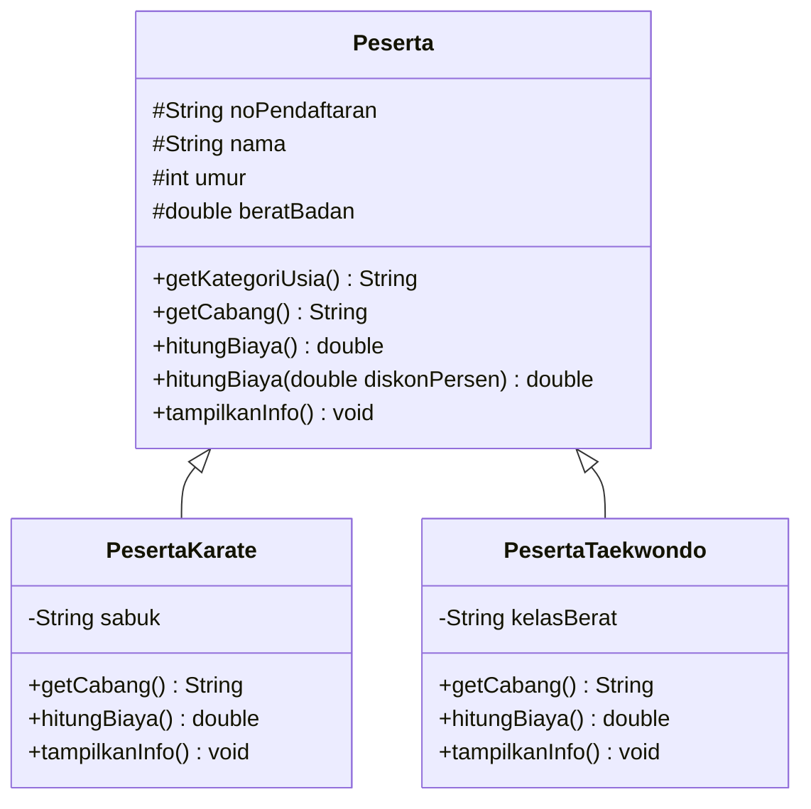
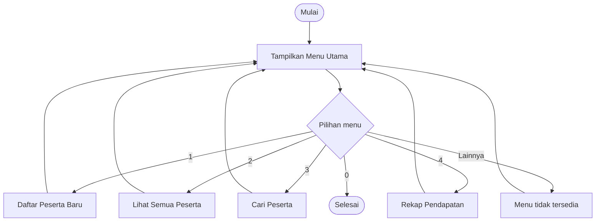

# Sistem Pendataan Pendaftaran Pertandingan Bela Diri

Tugas UTS Pemrograman Berorientasi Objek (Java)

| | |
|---|---|
| **Nama** | Muhammad Arza Dwiarto Anugerah |
| **NIM** | 2509116007 |
| **Mata Kuliah** | Pemrograman Berorientasi Objek |

---

## 1. Deskripsi Proyek

Program ini adalah aplikasi berbasis konsol (CLI) untuk mengelola pendaftaran peserta pada sebuah kejuaraan bela diri. Panitia dapat mendaftarkan peserta dari cabang **Karate** dan **Taekwondo**, melihat daftar peserta, mencari peserta berdasarkan nama, dan melihat rekap jumlah peserta beserta total pendapatan biaya pendaftaran.

### Fungsi utama

- Mendaftarkan peserta baru dengan nomor pendaftaran otomatis (`REG-001`, `REG-002`, dst).
- Menghitung biaya pendaftaran sesuai cabang. Karate sabuk hitam Rp200.000, sabuk lainnya Rp150.000, dan Taekwondo Rp175.000.
- Memberi diskon 10% untuk peserta di bawah 12 tahun.
- Menentukan kategori usia (Anak-anak, Pra-remaja, Remaja, Dewasa) dan kelas berat Taekwondo secara otomatis.
- Memvalidasi input (umur harus 6 sampai 60 tahun, berat badan harus lebih dari 0, input angka harus benar).
- Menampilkan daftar peserta, pencarian, dan rekap pendapatan.

### Penerapan konsep OOP

| Elemen | Penerapan |
|---|---|
| **Inheritance** | `PesertaKarate` dan `PesertaTaekwondo` mewarisi class `Peserta` |
| **Polymorphism (Overriding)** | `getCabang()`, `hitungBiaya()`, dan `tampilkanInfo()` di-override oleh tiap class turunan |
| **Polymorphism (Overloading)** | `hitungBiaya()` dan `hitungBiaya(double diskonPersen)` pada class `Peserta` |
| **Condition (if-else)** | Kategori usia, kelas berat, biaya sabuk hitam, validasi input, dan pemilihan menu |
| **Looping** | `do-while` pada menu utama, `for` pada tampilan daftar, `for-each` pada pencarian dan rekap |

### Struktur file

```
beladiri/
├── Main.java              # Program utama (menu, input, fitur)
├── Peserta.java           # Parent class
├── PesertaKarate.java     # Child class
├── PesertaTaekwondo.java  # Child class
├── README.md
└── screenshots/           # Screenshot output program
```

### Diagram class



---

## 2. Alur Program

### 2.1 Cara menjalankan

**Kebutuhan:** JDK (Java Development Kit) versi 8 atau lebih baru.

1. Simpan keempat file `.java` dalam satu folder yang sama.
2. Buka terminal atau command prompt pada folder tersebut.
3. Compile semua file:
   ```
   javac *.java
   ```
4. Jalankan program:
   ```
   java Main
   ```

### 2.2 Alur kerja sistem



Program berjalan dalam sebuah perulangan `do-while` yang terus menampilkan menu sampai pengguna memilih `0`.

**Menu 1, Daftar Peserta Baru**
1. Pengguna memilih cabang (1 = Karate, 2 = Taekwondo).
2. Pengguna mengisi nama, umur, dan berat badan.
3. Program memvalidasi data. Jika umur di luar 6 sampai 60 tahun atau berat badan tidak valid, pendaftaran ditolak.
4. Jika Karate, program meminta warna sabuk. Jika Taekwondo, kelas berat ditentukan otomatis dari berat badan.
5. Objek `PesertaKarate` atau `PesertaTaekwondo` dibuat, dimasukkan ke `ArrayList<Peserta>`, lalu nomor pendaftaran ditampilkan.

**Menu 2, Lihat Semua Peserta**
Program melakukan perulangan pada seluruh peserta, memanggil `tampilkanInfo()` (polymorphism, sehingga tiap peserta menampilkan info sesuai cabangnya), lalu menampilkan biaya. Peserta di bawah 12 tahun memakai `hitungBiaya(10)` (diskon 10%), sedangkan lainnya memakai `hitungBiaya()`.

**Menu 3, Cari Peserta**
Program mencari peserta yang namanya mengandung kata kunci (tidak peka huruf besar/kecil), lalu menampilkan datanya. Jika tidak ada, muncul pesan tidak ditemukan.

**Menu 4, Rekap Pendapatan**
Program menghitung jumlah peserta per cabang (memakai `instanceof`) dan total pendapatan dari seluruh biaya pendaftaran setelah diskon.


## 3. Penjelasan Gambar (Screenshot Output)

### Gambar 1. Tampilan menu utama


Menampilkan menu utama program berisi lima pilihan: daftar peserta baru, lihat semua peserta, cari peserta, rekap pendapatan, dan keluar. Menu ini muncul berulang berkat perulangan `do-while`.

### Gambar 2. Pendaftaran peserta Karate


Proses pendaftaran peserta Karate. Setelah data diisi, program membuat objek `PesertaKarate` dan menampilkan nomor pendaftaran `REG-001`.

### Gambar 3. Pendaftaran peserta Taekwondo


Proses pendaftaran peserta Taekwondo. Program tidak meminta input kelas berat karena sudah ditentukan otomatis oleh `if-else` di constructor `PesertaTaekwondo`.

### Gambar 4. Daftar semua peserta


Menampilkan seluruh peserta terdaftar. Terlihat bahwa informasi tiap cabang berbeda (Karate menampilkan sabuk, Taekwondo menampilkan kelas berat), padahal dipanggil lewat method yang sama, yaitu `tampilkanInfo()`.

### Gambar 5. Pencarian peserta


Hasil pencarian dengan kata kunci nama. Program menampilkan data peserta yang namanya cocok.

### Gambar 6. Rekap pendapatan


Menampilkan jumlah peserta tiap cabang dan total pendapatan. Dengan data uji: Karate 2 orang, Taekwondo 1 orang, total 3 peserta, total pendapatan Rp505.000 (180.000 + 175.000 + 150.000).

### Gambar 7. Validasi input


Contoh validasi input

---

## Catatan

Program ini dibuat untuk memenuhi ketentuan UTS PBO dengan elemen wajib: inheritance (2 tipe), polymorphism (overriding dan overloading), condition (if-else), dan looping.
